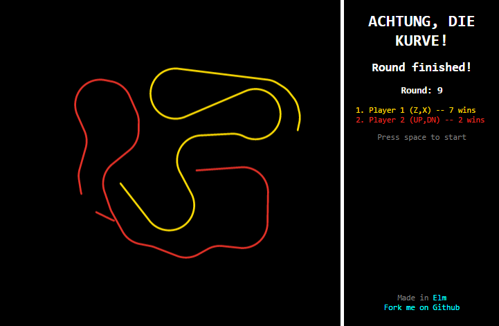

# Achtung (in Elm) – [Play!](http://gbark.github.io/achtung)

A browser based clone of **Achtung, die Kurve!** (also known as **Zatacka**) written in Elm.

## Run locally

Clone this repo and run using [elm-reactor](https://github.com/elm-lang/elm-reactor)

## Multiplayer Todo

* Predictively render Player
* Predictively render Opponents
* Introduce Game instances to server to handle multiple ongoing games
* Start a Game after 6 Players have joined OR 2+ Players have joined AND it 
has passed 30 seconds since the 2nd Player joined. Whichever comes first.
* Private Games with secret code or URL